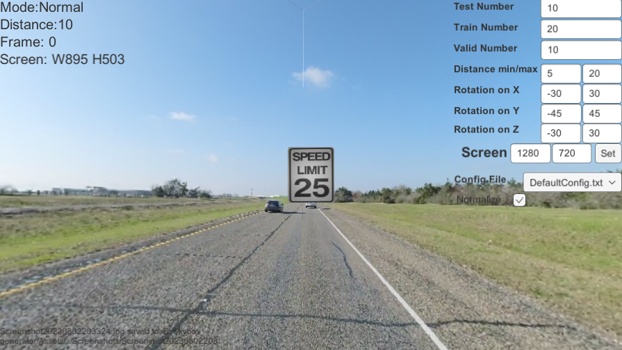
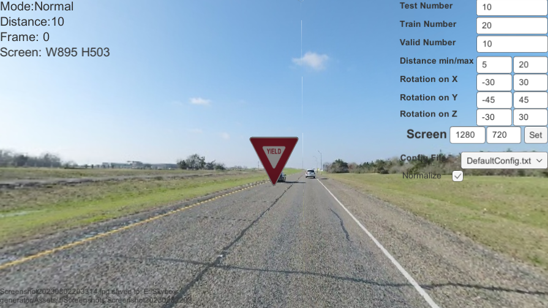
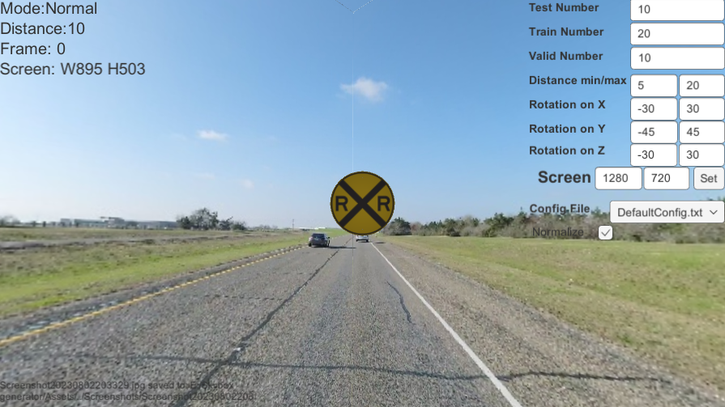
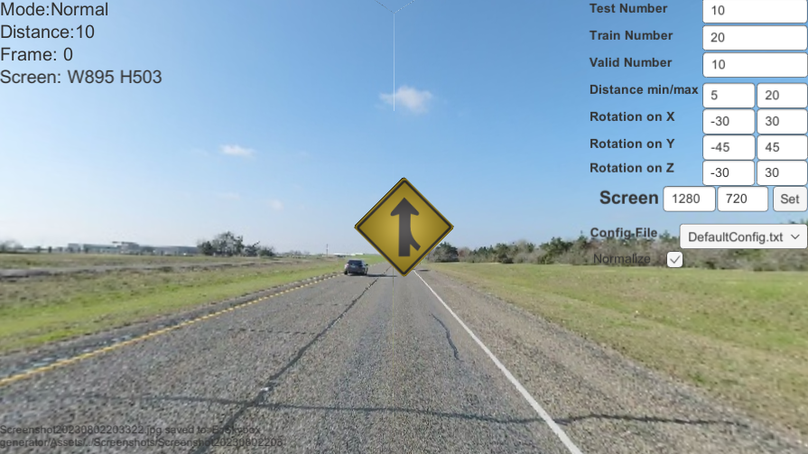

# Unity Based Data Generator

# 1.Description
This is a tool for creating images for training, especially for YOLO ([Random Generator Mode](#3-random-generator-mode-press-r-random-generating-dataset)). You can use the dataset to train your Model, or use it as an augment dataset for the training. 

# 2. How to use
## (1)Director Mode(Press D): only show skybox
- press w to move to next skybox
- press d to move back to last one
<p align="center">
  
</p>

## (2)Manual Mode(Press M): Manually create sign at specific location
- use mouse scroller to move sign back and forward
- use mouse to aim at specific location
- press left key to create at specific location 
<p align="center">
  
</p>

## (3)Random Generator Mode(Press R): Random generating dataset
- enter prefer number inside input field on right corner
- use right click to change sign
- use drop down to change preset configurations, you can create your own inside `skybox generator_data/StreamingAsssets/config`
- you can create your own sign inside  `skybox generator_data/StreamingAsssets/SignDictionary.txt`, each line inside this txt file represent a sign, and the order is:
  ```sh
  IDNumber Name Shape Width Height
  ```
- All shapes are provided in [Examples](#examples)
- After you add your line of sign, you can put a png image inside `skybox generator_data/StreamingAsssets/image`、
- Adding # at the front will ask the reader to escape current line
<p align="center">
  
</p>

### Data Structure format:
1. Images are store inside Directory `GeneratedData`.
2. `GeneratedData` is divided into three folder: `test`, `train` and  `valid`. 
3. These three folder are divided into `answer`, `image` and `label`
4. `image` contains all training images
5. `answer` contains all training images with red boxes indicating where is the bounding box of the target sign
6. `label` contains txt files which indicate the location and dimension of the target sign
 
### Examples:
#### Yield (invTriangle): 
<p align="center">
  
</p>

#### Railroad crossing (circle): 
<p align="center">
  
</p>

#### Speed limit (sqaure): 
<p align="center">
  
</p>

#### Merging from right (diamond): 
<p align="center">
  
</p>
