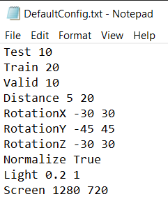
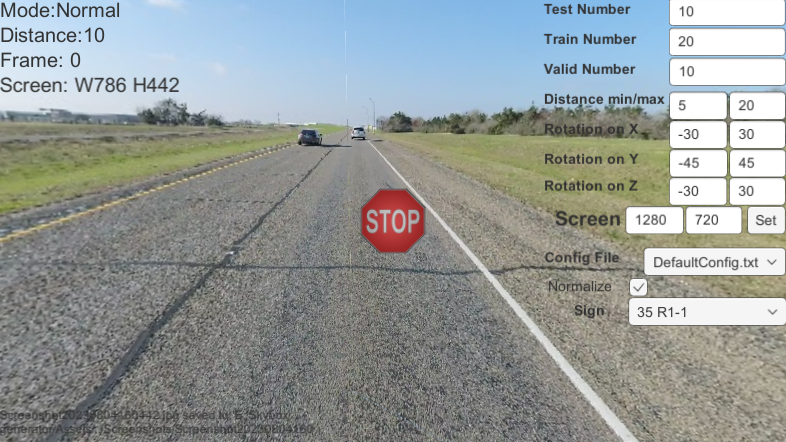

# Unity Based Data Generator

# 1.Description
This is a tool for creating images for training, especially for YOLO ([Random Generator Mode](#3-random-generator-mode-press-r-random-generating-dataset)). You can use the dataset to train your Model, or use it as an augment dataset for the training. 

# 2. How to use
Pick your favorate release, download it and run!!!
## (1)Director Mode(Press D): only show skybox
<p align="center">
  
</p>

- press w to move to next skybox
- press d to move back to last one


## (2)Manual Mode(Press M): Manually create sign at specific location
<p align="center">
  
</p>

- use mouse scroller to move sign back and forward
- use mouse to aim at specific location
- press left key to create at specific location 


## (3)Random Generator Mode(Press R): Random generating dataset
<p align="center">
  
</p>

- enter prefer number inside input field on right corner
- use right click to randomly changing a sign, and use the drop down menu to choose manually
- use drop down to change preset configurations, you can create your own inside `skybox generator_data/StreamingAsssets/config`
- you can create your own sign inside  `skybox generator_data/StreamingAsssets/SignDictionary.txt`, each line inside this txt file represent a sign, and the order is:
  ```sh
  IDNumber Name shapesTypes Width Height
  ```
- All shapesTypes are provided in [Examples](#examples)
- After you add your line of sign, you can put a png image inside `skybox generator_data/StreamingAsssets/image`
- Adding # at the front will ask the dictionary reader to escape current line


### Data Structure format:
1. Images are store inside Directory `GeneratedData`.
2. `GeneratedData` is divided into three folder: `test`, `train` and  `valid`. 
3. These three folder are divided into `answer`, `image` and `label`
4. `image` contains all training images
5. `answer` contains all training images with red boxes indicating where the bounding box of the target sign is
6. `label` contains txt files which indicate the location and dimension of the target sign
### Config file format: 
- `Test` : number of test pictures
- `Train` : number of train pictures
- `Valid` : number of valid pictures
- `Distance` : range of distance of the sign from the camera, unit is meter 
- `RotationX` : range of rotation on X axis, unit is degree
- `RotationY` : range of rotation on Y axis, unit is degree
- `RotationZ` : range of rotation on Z axis, unit is degree
- `Normalize` : number in text label is normalize or not, value is `True/False`
- `Light` : range of light intensity of the sign, value is float from `0 ~ 1`
- `Screen` : width and height of the screen, unit is pixel
<p align="center">
  
</p>
If you do not include the `keywords` inside config, the value at input file will be left as empty after loading that file.

### Examples:

#### Yield (invTriangle): 
<p align="center">
  
</p>

#### Railroad crossing (circle): 
<p align="center">
  
</p>

#### Speed limit (sqaure): 
<p align="center">
  
</p>

#### Merging from right (diamond): 
<p align="center">
  
</p>

#### Stop Sign (octa): 
<p align="center">
  
</p>
